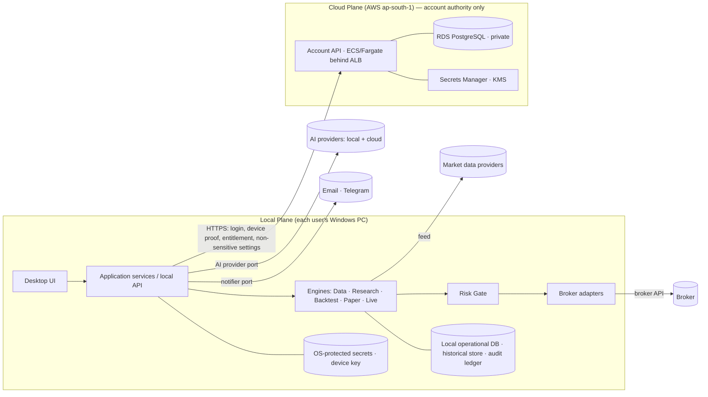
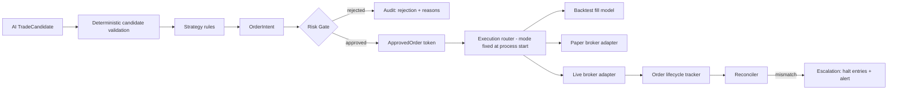
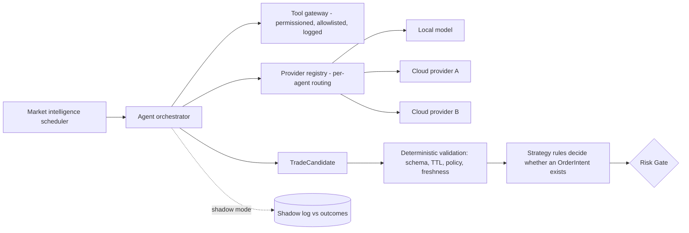

# AlgoFortis V2 — Architecture

| Field | Value |
|---|---|
| Document | `ALGOFORTIS_V2_ARCHITECTURE.md` (2 of 5) |
| Version | v0.1 DRAFT — for Owner review |
| Date | 2026-09-21 |
| Implements | `ALGOFORTIS_V2_REQUIREMENTS.md` (requirement IDs cited inline) |
| Status | PROPOSED. Items marked **[OD-xx]** are not frozen. Stack-specific choices are illustrative unless an ADR (§18) freezes them. |

---

## 1. Purpose and principles

This document defines how AlgoFortis V2 is structured so that future growth ships as V2.x modules, adapters, migrations and configuration — not a core rewrite.

| # | Principle | Consequence |
|---|---|---|
| P1 | **Contracts first** | Every module boundary is a versioned contract; code follows contracts, never the reverse. |
| P2 | **One path to an order** | Only the Risk Gate can mint an executable order. No strategy, AI, UI or adapter has a side door. |
| P3 | **Fail closed** | Uncertainty, corruption, invalid state, reconciliation mismatch → halt new risk, keep protective logic running, alert. |
| P4 | **Deterministic core** | Time, randomness and IDs are injected. Same inputs → same outputs. |
| P5 | **Local-first execution** | Trading engine, credentials, strategies and positions live on the user's PC. Cloud holds identity, devices and entitlement only. |
| P6 | **Everything replaceable** | Broker, data, storage, AI provider, notifier, auth provider, clock, deployment target sit behind ports. |
| P7 | **Evidence by default** | Every important action and state transition emits an audit event carrying versions. |
| P8 | **Explicit state** | Every lifecycle is a named state machine with an allowed-transition table. No implicit states. |
| P9 | **Never auto-arm** | Restart, crash, update, reconnect or outage recovery can never move the system to ARMED on its own. |
| P10 | **Humans outrank models** | Human-defined policy and hard limits always outrank strategy or AI output. |

---

## 2. System context

Two planes and a set of external systems. The trust boundary between planes is deliberate: the cloud plane cannot place, cancel or modify orders.



**What lives where (locked)**

| Local plane | Cloud plane |
|---|---|
| Trading engine, strategies, strategy configs, broker credentials, trade logs, live positions, local execution state, local audit | Identity, WebAuthn public credentials, device registry, session/refresh-token families, recovery state, entitlement/licence, non-sensitive preferences |

**Not allowed**: broker secrets in the central DB; server-side order execution; cloud outage causing fail-open authentication; silent device eviction; trust by hostname/MAC/hardware fingerprint alone.

---

## 3. Module map and dependency rules

### 3.1 Modules (AF2-ARC-001)

| Module | Owns | Exposes (contract) | Depends on (ports) |
|---|---|---|---|
| Data | catalog, datasets, quality, live feed normalization | `MarketDataPort`, `DatasetCatalog` | Storage, Clock, provider adapters |
| Research | experiments, param search, robustness | `ExperimentService` | Data, Backtest, Storage |
| Strategy | SDK runtime, strategy registry, lifecycle | `StrategyPort`, `StrategyRegistry` | Data, Config |
| Backtest | simulator, fill/latency/fee models | `RunService` | Data, Strategy, Risk (same gate), Clock |
| Paper | paper broker adapter, drift reports | `BrokerPort` (paper impl) | Data, Risk, Storage |
| Live | engine state machine, reconciler, recovery | `LiveEngine` | Broker, Risk, Data, Audit |
| Risk | gate, limits, kill switches, governance | `RiskGate`, `KillSwitch` | Config, Portfolio, Audit |
| Broker | broker adapters | `BrokerPort` | Secrets, Clock |
| Portfolio | capital allocation, exposure, attribution | `PortfolioService` | Risk, Storage |
| AI | provider registry, tool gateway, orchestrator | `AIProviderPort`, `ToolGateway` | Secrets, Audit, Config |
| Audit | event envelope, ledger, hash chain, export | `AuditSink` | Storage, Clock |
| Auth | client side of anywhere-login, device identity | `AuthPort` | Cloud API, OS key store |
| Notifications | providers, dedupe, delivery tracking | `NotifierPort` | Secrets, Audit |
| Reporting | report modules, exports | `ReportPort` | Storage |
| Entitlement *(T1 client, T2 billing)* | licence checks | `EntitlementPort` | Auth |

### 3.2 Layering

```
UI / Local API (transport)
        │
Application services (use-cases, orchestration, transactions)
        │
Domain (entities, state machines, risk math, pure logic)   ← no imports from adapters
        │
Ports (interfaces)
        ▲
Adapters (broker, data, storage, AI, notifier, OS/secrets, cloud client)
```

**Rules (enforced by architecture tests in CI — AF2-OPS-002)**
1. Domain imports nothing from adapters, UI or transport.
2. A module never reads another module's tables; it calls that module's contract.
3. No module owns a global mutable singleton shared with another engine.
4. Live adapters are not importable from the backtest or paper entrypoints (see §5.3).
5. Vendor-specific field names stop at the adapter boundary (AF2-ARC-002).

Use a language-appropriate import-boundary checker (for example `import-linter` for Python) as the enforcement mechanism.

---

## 4. Core contracts

Contracts are versioned (`schema_version`) and validated at every boundary. The definitions below are the minimum shape; field lists are frozen in the ADR for each contract.

### 4.1 Cross-cutting ports
```text
Clock            now_utc(), monotonic_ns(), session_calendar()          # injected everywhere (ARC-003)
SeedSource       seed_for(run_id, component)
IdGenerator      new_id(kind)                                           # ULID-style, sortable
SecretsPort      get(secret_ref)  # returns handle/ephemeral value, never logged
StoragePort      transactional operational store; append-only ledger
ConfigPort       resolve(layers…) -> ImmutableConfigSnapshot
AuditSink        emit(AuditEvent)                                       # fail-closed for critical actions
```

### 4.2 Trading contracts
```text
OrderIntent {
  intent_id, strategy_id, strategy_version, run_mode(BACKTEST|PAPER|LIVE),
  instrument_ref, side(BUY only for options scope), qty, order_type, limit?,
  protective{sl?, target?, trailing?}, created_at, valid_until (TTL), source(STRATEGY|AI_CANDIDATE|MANUAL),
  provenance{candidate_id?, dataset_version, config_snapshot_id}
}

RiskDecision {
  intent_id, decision(APPROVED|REJECTED|REDUCED), reasons[], risk_rule_version,
  limits_snapshot_id, approved_qty?, approval_token?   # token only present when APPROVED
}

ApprovedOrder {            # capability object; constructible ONLY by RiskGate
  client_order_id (idempotent), intent_id, risk_decision_ref, run_mode, expires_at
}

BrokerPort {
  capabilities(), place(ApprovedOrder), cancel(client_order_id),
  modify(client_order_id, …), orders(), positions(), funds(), health()
}                          # place() rejects anything that is not an ApprovedOrder for the adapter's run_mode
```

### 4.3 Audit envelope (AF2-AUD-001)
```text
AuditEvent {
  event_id, seq (monotonic per ledger), ts_utc, actor{type,id}, account_id, device_id?,
  correlation_id, run_id?, action, entity{type,id}, before?, after?,
  reason, source,
  versions{app, strategy?, risk_rule?, broker_adapter?, dataset?, model_agent?},
  prev_hash, hash                                   # hash chain (tamper evidence)
}
```

### 4.4 Run manifest (reproducibility, AF2-BKT-002)
```text
RunManifest {
  run_id, mode, code_version, dataset_versions[], config_snapshot_id,
  seed_map, env_fingerprint, event_ordering_version, fingerprint (hash of all above),
  ledger_ref
}
```

---

## 5. The Safety Spine (single path to an order)

### 5.1 Flow


### 5.2 Guarantees and how they are enforced
| Guarantee | Enforcement |
|---|---|
| No strategy or AI bypasses risk | `ApprovedOrder` constructor is private to `RiskGate`; `BrokerPort.place` accepts only that type; contract test tries to construct one elsewhere and must fail. (INV-03) |
| AI cannot place orders | AI output type is `TradeCandidate`; conversion to `OrderIntent` happens only through deterministic strategy rules (§11). (INV-14) |
| Duplicate order for same intent impossible | `client_order_id` derived from `intent_id`; lifecycle tracker refuses second submission; in-doubt handling per §6.2. (INV-01) |
| Stale intent never submitted | `valid_until` checked at gate and again at router; restart discards non-submitted intents. (INV-02) |
| Hard limits cannot be exceeded from below | Limits resolved through hierarchy (§9.2); gate uses the resolved snapshot and records its ID. (INV-11) |
| Options BUY-only | Rule enforced in the gate for current product scope, independent of strategy code. (AF2-OPT-002) |

### 5.3 Mode isolation
- `run_mode` is fixed when the process starts (`BACKTEST`, `PAPER`, `LIVE`). It cannot change at runtime.
- The live broker adapter and its credentials are **not loaded** in BACKTEST/PAPER processes; paper adapter has no code path to real order endpoints. (INV-05, INV-06)
- The gate stamps `run_mode` on `ApprovedOrder`; an adapter rejects a token whose mode does not match its own.
- Global overlay: `READ_ONLY` and `DISARMED` remain the shipped defaults. While set, the live adapter's mutating methods are unreachable (V1 contract preserved).

---

## 6. State machines

### 6.1 Live engine (AF2-LIV-004)
| From → To | Trigger / guard |
|---|---|
| DISABLED → READY | Preflight PASS (config valid, clock drift OK, broker reachable, audit writable, recon baseline clean) |
| READY → CONNECTING | Owner/user explicit start |
| CONNECTING → ACTIVE | Feed + broker healthy, reconciliation clean, **explicit ARM action** |
| ACTIVE ⇄ DEGRADED | Feed stale, broker latency/degradation, auth-service offline (local safety continues) |
| ACTIVE/DEGRADED → PAUSED | Manual pause or risk circuit breaker |
| any → EMERGENCY_STOP | Kill switch, integrity failure, unresolved reconciliation mismatch, audit-write failure |
| EMERGENCY_STOP → RECOVERY | **Manual only** |
| (process start after crash/update/sleep-resume) → RECOVERY | Automatic entry into RECOVERY, never ACTIVE |
| RECOVERY → READY | Reconciliation PASS + recovery report generated |

Any transition not in this table is rejected and audited. `ARMED` is a separate latch that is always `false` after process start.

### 6.2 Order lifecycle (AF2-LIV-003)
```
INTENT_CREATED → RISK_REJECTED (terminal)
               → RISK_APPROVED → SUBMITTING → SENT_UNACKED ─┬→ ACKED → PARTIALLY_FILLED → FILLED (terminal)
                                                            │       ↘ CANCEL_PENDING → CANCELLED (terminal)
                                                            │       ↘ REJECTED (terminal)
                                                            └→ IN_DOUBT (timeout / no ack)
IN_DOUBT → resolved by broker order query → ACKED | REJECTED | NOT_FOUND
NOT_FOUND → eligible for retry only with the SAME client_order_id and only if intent still within TTL and Risk Gate re-approves
EXPIRED (terminal) when TTL passes before submission
```
Rule: **no retry while IN_DOUBT.**

### 6.3 Strategy lifecycle (AF2-STR-002)
`DRAFT → RESEARCH → BACKTEST → VALIDATION → PAPER → ELIGIBLE_FOR_LIVE`, with `REJECTED(reason)` and `DEACTIVATED` reachable from any state and `ROLLED_BACK(to_version)` for deployed versions. Each forward transition requires stored promotion evidence that meets the configured criteria; nothing promotes on backtest P&L alone.

### 6.4 AI candidate lifecycle (§11)
`PROPOSED → VALIDATED | REJECTED → CONSUMED_BY_STRATEGY | EXPIRED`

---

## 7. Determinism and replay (AF2-BKT-002)

- **Single ordering rule**: events ordered by `(exchange_ts, source_priority, sequence_no)`; the rule has a version recorded in every `RunManifest`.
- **Injected everything**: `Clock`, `SeedSource`, `IdGenerator`; no wall-clock reads in domain code.
- **Append-only event ledger** per run. Results (P&L, metrics, reports) are derived views that can be rebuilt from the ledger.
- **Replay**: a ledger + manifest replays to an identical fingerprint. The same mechanism is used for incident reconstruction in live/paper.
- **Numeric policy**: decimal/fixed-point for money/price/qty/risk; analytics floats compared with declared tolerance. **[OD-V2-12]**
- **Cross-machine test**: the golden suite runs on at least two machines/environments in CI and must produce identical fingerprints for deterministic components.

---

## 8. Data architecture

| Concern | Design |
|---|---|
| Operational data | Transactional local store for orders, positions, state, config snapshots, audit ledger. Current V1 choice retained unless an ADR changes it. |
| Historical data | Separate immutable, versioned dataset store with a catalog (dataset ID → version → checksum, provenance, lineage, coverage, quality score). Technology choice **[OD-V2-13]** (columnar files + catalog is the proposed direction). |
| Dataset immutability | New data = new dataset version. Runs reference versions, never "latest". |
| Quality pipeline | ingest → schema check → gap/duplicate/outlier detection → quarantine → scorecard → publish version. |
| Resampling | Deterministic rules stored with the dataset version; 1m is the source of truth for higher timeframes. |
| Live feed | Adapter → normalized `QuoteEvent{exchange_ts, recv_ts, seq, source}` → feed monitor (heartbeat, gaps, staleness, skew) → market-status state machine → consumers. Stale ⇒ risk gate blocks entries. |
| Options data | Option instrument master with as-of-date lot/expiry rules; historical chain + IV/Greeks source or **labelled** synthetic fallback. **[OD-V2-10]** |
| Licensing | Each data adapter manifest carries `license_terms` and `permitted_use`; prohibited programmatic sources stay dormant behind a gate. (AF2-DAT-008) |
| Backup/retention | Automated backups; restore verified; retention per policy; archive tier is T2. |

---

## 9. Configuration architecture (AF2-ARC-009)

### 9.1 Layers
`system → environment → user → strategy → run` (a `tenant` layer exists only in the central account service). Each layer is schema-validated and versioned. At run start the resolved result is frozen as an **immutable snapshot** whose ID is stored in the run manifest and audit events.

### 9.2 Hard-limit hierarchy (AF2-ARC-005)
```
Platform hard maximum  >  Owner policy  >  User limits  >  Strategy limits  >  Run overrides
```
Resolution takes the most restrictive applicable value. A lower layer that tries to exceed a higher one fails validation and is audited.

### 9.3 Secrets
Config never contains secrets — only `secret_ref` handles resolved by `SecretsPort`. Local: OS-protected store (DPAPI). Cloud: Secrets Manager. Broker credentials are never synced or centralized.

---

## 10. Adapter and plugin architecture (AF2-ARC-008)

V2.0 uses an **internal adapter registry**; third-party sandboxed plugins are T2. **[OD-V2-14]**

```yaml
# adapter manifest (illustrative)
id: broker.example
kind: broker            # broker | data | ai_provider | notifier | report | fee_model | slippage_model | execution_model | risk_rule | indicator | strategy
version: 1.4.0
contract: BrokerPort@2
capabilities: [orders, positions, funds, cancel, modify, bracket_orders]
permissions: [network:broker-api, secret:broker-credentials]
compatible_core: ">=2.0,<3.0"
license_terms: "…"          # data adapters
```

Registry rules: capability discovery before activation; compatibility check against core and contract versions; enable / disable / rollback; every activation audited; adapters run in-process in V2.0 with declared permissions enforced at the port layer.

---

## 11. AI architecture



**Tool gateway**: AI has no direct DB, filesystem or broker access. Each tool declares read/write scope; calls are validated, rate-limited, budgeted and audited. Retrieved web/news content is labelled untrusted and never interpreted as instructions.

**TradeCandidate contract** (AF2-AIA-003)
```text
TradeCandidate {
  candidate_id, schema_version, instrument_ref,
  action(CANDIDATE_BUY | HOLD | NO_TRADE),
  strategy_id, strategy_version, thesis_codes[], regime,
  entry_conditions[], invalidation_conditions[], risk_assumptions,
  data_ts, freshness_ms, evidence_refs[],
  provenance[{agent, model, provider, prompt_version}],
  committee{agreement, dissent[], correlated_model_flag},   # T2 fields optional in V2.0
  calibrated_confidence, created_at, expires_at (TTL)
}
```
Rejected by validation if malformed, stale, unsupported, or policy-violating. Committee deadlines ensure a late response cannot create a stale trade. Provider outage degrades to NO_TRADE/HOLD; it never silently changes trading behaviour.

**V2.0 ceiling**: research + shadow mode. Any AI-assisted live eligibility additionally requires paper validation (AF2-AIA-007). Committee/ensemble is T2 behind the same contract.

---

## 12. Security architecture

| Area | Design |
|---|---|
| Identity | Locked anywhere-login: WebAuthn for interactive auth; separate device-binding key (TPM/CNG non-exportable, DPAPI fallback); 15-min access token; rotating refresh token, reuse detection revokes the device chain; 30-day absolute / 7-day inactivity; ≤ 3 devices; step-up on new device; revoke is server-side. |
| Transport | HTTPS only, one canonical production domain, no raw-IP login, WebAuthn RP-ID/origin matching, no secrets in URLs. |
| Local secrets | OS-protected storage; excluded from logs, crash dumps, backups; broker credentials re-entered per device. |
| Authorization | Owner/Admin/User roles per `AUTH_ACCESS_CONTRACT_V1`; capability-based permissions for adapters and AI tools. |
| Local integrity | Hash-chained local audit; integrity check of risk configuration at load; signed release artifacts; instance lock. (AF2-SEC-006, AF2-HOST-001) |
| Supply chain | Dependency lock, scanning, SBOM, signed installer/updates. |
| Central service | Private DB, IAM task roles, KMS at rest, TLS to DB, rate limiting, audit logging, tenant-escape tests. |

---

## 13. Account plane and failure semantics

| Event | Behaviour |
|---|---|
| Cloud/auth service offline | UI shows `AUTH SERVICE OFFLINE — LOCAL SAFETY CONTINUES`. Already-running local engine, risk controls, protective SL/target logic, reconciliation and position monitoring continue in local degraded mode. New login, new-device enrollment, recovery and entitlement changes fail closed. Nothing is ever armed, loosened or bypassed because of an outage. |
| Access token expires while offline | Local app follows session policy; no new sensitive account operations. Local safety unaffected. |
| Device revoked | Refresh hard-fails; device cannot obtain new tokens. Local protective logic keeps running until the user stops it; live re-arming is impossible without valid session. |
| High-assurance recovery | All sessions, refresh families and registered device keys revoked; trusted status cleared; fresh enrollment required. |
| Same-PC reinstall | Device-identity metadata under `%LOCALAPPDATA%\AlgoFortis\Security\DeviceIdentity\` survives uninstall; key rediscovered and proven against the server public key; if key missing/corrupt → fail closed, new enrollment. |

Cost guardrails, region, service list and backup rules are as locked in the anywhere-login decision sheet and are not restated here.

---

## 14. Observability and audit architecture

- **Audit** is the source of truth for "what happened and why" (hash chain, versions on every event). **Logs/metrics** answer "how is it behaving".
- **Correlation**: every request/run/intent carries `correlation_id`; audit, logs and metrics join on it.
- **Fail-closed audit**: if a trading-critical action cannot be recorded, it is not executed. (AF2-AUD-002)
- **Metrics and alerts**: as AF2-OBS-002/003. Alert router supports priority levels, dedupe/throttle, and **two independent channels for critical alerts**. (AF2-OBS-004)
- **Redaction** applied at the logging boundary; secrets are never passed to loggers.

---

## 15. Deployment and packaging

- Installer: normal Setup.exe, bundled runtime, no terminal, immutable app under Program Files, mutable/security state under `%LOCALAPPDATA%\AlgoFortis\`.
- Release channel and updater: signed artifacts; policy for forced vs optional and rollback **[OD-V2-20]**; **no update or restart while ACTIVE or holding open positions** (AF2-ACC-008); never auto-arm afterwards.
- Upgrade sequence: precheck (DB, config, strategy and adapter compatibility) → automatic backup → migrate → verify → start in RECOVERY → reconcile → READY. Rollback package retained and rollback path tested.
- Environments: local dev, CI, staging, production, with a parity strategy; reproducible builds and dependency locks.
- Feature flags with per-feature kill switch and canary rollout.

---

## 16. Failure-mode matrix (fail-closed defaults)

| Failure | Detection | System response | Operator action |
|---|---|---|---|
| Feed stale / gap | heartbeat, seq, staleness threshold | Block new entries; keep exits; DEGRADED | Investigate feed; resume when healthy |
| Broker disconnect | health check / API errors | DEGRADED; cancel-safe posture; retry with backoff | Reconnect; recon before resume |
| Order sent, no ack | timeout | IN_DOUBT; query broker; no retry | Review if unresolved |
| Reconciliation mismatch | recon loop | EMERGENCY_STOP for that account; alert | Manual review; explicit resume |
| Foreign order/position | recon vs system intents | Halt new entries; alert | Adopt explicitly or clear |
| Second device armed on same broker account | foreign activity in recon; arm-ownership check | Halt entries on both; alert | Resolve which device owns live |
| Local crash / power loss | supervisor / next start | Start in RECOVERY; reconcile; never auto-arm | Review recovery report; re-arm manually |
| Sleep / resume | OS power event | DEGRADED → RECOVERY | Confirm state |
| Clock drift beyond limit | time check | Block arming; alert | Fix time sync |
| Audit write failure | sink error | Block trading-critical actions | Fix storage |
| DB corruption | integrity check | Read-only emergency mode | Restore from verified backup |
| Risk config tampered / invalid | integrity check at load | Refuse to start live | Restore known-good config |
| Cloud/auth outage | client errors | Local safety continues; account operations fail closed | Wait / retry |
| AI provider outage | health/timeouts | NO_TRADE / HOLD; fallback only to approved provider | None required |
| Update available during live | updater policy | Deferred until safe window | Approve window |

---

## 17. Versioning and compatibility

- **Contracts**: semantic versioning; additive changes minor, breaking changes major with a compatibility window and deprecation notice.
- **Persisted schemas**: version stamp on every store; forward migrations only; each migration tested on a copy of real-shaped data, with automatic pre-migration backup and rollback plan.
- **Adapters/strategies**: manifests declare compatible core/contract ranges; registry blocks incompatible activation.
- **Core**: V2.x remains backward compatible for stored data, configs and strategies within V2. V3 is considered only if the business model, execution model, regulatory model or computing model fundamentally changes.

---

## 18. Architecture Decision Record index (to be written and frozen)

| ADR | Decision | Linked OD |
|---|---|---|
| ADR-001 | Build-order authority and phase map | OD-V2-01 |
| ADR-002 | Deployment model (local-first; hosted engine later) | OD-V2-02 |
| ADR-003 | Multi-device live exclusivity mechanism | OD-V2-05 |
| ADR-004 | Foreign-order policy | OD-V2-06 |
| ADR-005 | Kill-switch semantics | OD-V2-07 |
| ADR-006 | Broker-resident protective orders | OD-V2-08 |
| ADR-007 | Historical store technology and catalog | OD-V2-13 |
| ADR-008 | Numeric policy | OD-V2-12 |
| ADR-009 | Plugin scope for V2.0 | OD-V2-14 |
| ADR-010 | AI ceiling, provider set, data-sharing rules | OD-V2-15, OD-V2-16 |
| ADR-011 | Options data source and synthetic labelling | OD-V2-10 |
| ADR-012 | Update/licence/telemetry policies | OD-V2-20…22 |

---

## 19. Traceability

| Architecture § | Requirement IDs |
|---|---|
| 3 | ARC-001, ARC-002, ARC-007, OPS-002 |
| 4, 5 | RSK-003, LIV-001…003, PPR-001/002, OPT-002, AIA-001 |
| 6 | LIV-003/004, STR-002 |
| 7 | BKT-002, ARC-003, ARC-006 |
| 8 | DAT-001…009, OPT-004 |
| 9 | ARC-005, ARC-009 |
| 10 | ARC-008, ARC-011 |
| 11 | AIA-001…010 |
| 12, 13 | SEC-001…006, ACC-001…008 |
| 14 | AUD-001…003, OBS-001…004 |
| 15 | OPS-001…003, ACC-004/008 |
| 16 | LIV-005…010, HOST-001…006, DRB-001 |
