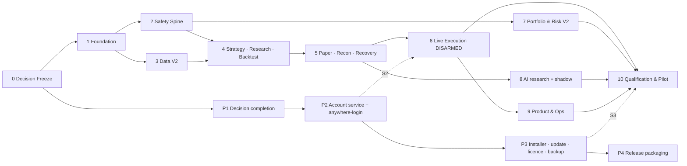

# AlgoFortis V2 — Implementation Plan

| Field | Value |
|---|---|
| Document | `ALGOFORTIS_V2_IMPLEMENTATION_PLAN.md` (3 of 5) |
| Version | v0.1 DRAFT — for Owner review |
| Date | 2026-09-21 |
| Implements | `ALGOFORTIS_V2_REQUIREMENTS.md` on the structure in `ALGOFORTIS_V2_ARCHITECTURE.md` |
| Status | PROPOSED. Becomes canonical only when **OD-V2-01** (build-order authority) is frozen. |

---

## 1. Principles

1. **Documentation-first, decision-gated.** No phase starts until its blocking Owner Decisions are frozen (matrix in `ALGOFORTIS_V2_OWNER_DECISIONS.md` §5).
2. **Safety spine before features.** Risk gate, order lifecycle and mode isolation exist and are tested before any adapter, strategy or AI component can produce an order.
3. **Small verified slices.** Each slice is one bounded change with tests, audit events, observability hooks, rollback and docs (§6).
4. **No big-bang rewrite.** V1 working components are wrapped behind contracts and migrated, not rewritten.
5. **Live stays DISARMED** (`READ_ONLY = true`, zero broker mutation) until the Live-Eligible Milestone (§8) and explicit Owner sign-off.
6. **Two tracks in parallel, joined at sync points.** Trading Core (Phases 0–10) and the Platform/Account Track (P1–P4) run in parallel and join at S1–S3.
7. **Sizes are relative, not calendar promises.** S ≈ days, M ≈ 1–3 weeks, L ≈ 1–2 months, XL > 2 months of focused solo work. Re-estimate at each gate.

---

## 2. Corrections to the master build order (MC §28)

| # | Issue in MC order | Correction |
|---|---|---|
| 1 | Security, CI/CD, observability arrive in Phase H (last). | CI, audit envelope, logging, security scanning move to **Phase 1**. Everything after depends on them. |
| 2 | Live execution (E) precedes Risk/Portfolio (F). | Risk gate, order lifecycle, kill-switch semantics move to **Phase 2**; portfolio risk stays later (Phase 7). |
| 3 | Paper soak only at final qualification. | Soak starts in **Phase 5** and keeps running through later phases. |
| 4 | No decision-freeze step before build. | **Phase 0** closes blocking ODs and captures the golden suite. |
| 5 | Account/device/installer/update/licence work is absent. | Added as **Track P** with sync points. |
| 6 | No definition of "first live" vs "V2 complete". | **Live-Eligible Milestone** (§8) separates a minimal safe live pilot from full V2.0. |
| 7 | AI layer (G) is a single large phase. | Split: research + shadow (V2.0, T1) vs committee/ensemble (T2). |
| 8 | Two competing build orders (existing V2 plan P0–P10 vs MC A–I). | One canonical order via **OD-V2-01**; mapping in §11. |

---

## 3. Phase map

| Phase | Name | MC phase | Size | Depends on | Exit gate |
|---|---|---|---|---|---|
| 0 | Decision Freeze & V1 Freeze Audit | A | M | — | G0 |
| 1 | Engineering Foundation | B (+H parts) | L | 0 | G1 |
| 2 | Safety Spine | E/F parts | L | 1 | G2 |
| 3 | Data V2 | C | L | 1 | G3 |
| 4 | Strategy SDK, Research & Backtest V2 | D | XL | 2, 3 | G4 |
| 5 | Paper V2, Reconciliation & Recovery | E part | L | 2, 3, 4 | G5 |
| 6 | Live Execution V2 (still DISARMED) | E part | XL | 5, S2 | G6 |
| 7 | Portfolio & Risk V2 | F | L | 2, 4 | G7 |
| 8 | AI / Agents V2 (research + shadow) | G | XL | 4, 5 | G8 |
| 9 | Product & Operations | H | L | 5, 6 | G9 |
| 10 | Release Qualification & Live Pilot | I | L | all, S3 | G10 |

**Parallel Track P (Platform/Account)**: P1 → P2 → P3 → P4, starting once Phase 0 is done.
**Sync points**: **S1** (Phase 2 exit): arm capability may exist in code but stays disabled. **S2** (before Phase 6 exit): device/session gating from Track P is required for any arm action. **S3** (before Phase 10): installer, updater, licence and backup/restore complete.



---

## 4. Trading Core phases

### Phase 0 — Decision Freeze & V1 Freeze Audit
- **Goal:** Start from a frozen, audited V1 and frozen scope decisions.
- **Scope:** OD-V2-01, 02, 03, 12 (minimum); V1 whole-repository A–Z audit; close all P0/P1; verify historical data coverage and provenance; freeze V1 contracts that V2 relies on; capture the **golden regression suite**; reconcile existing V2 documents with this baseline.
- **Deliverables:** frozen OD entries; V1 audit report; golden suite; V1 contract freeze list; phase map ADR-001.
- **Entry:** this document set reviewed by Owner.
- **Exit (G0):** blocking ODs frozen; zero open P0/P1; golden suite green and reproducible on two environments.
- **Risks:** hidden V1 defects; scope reopening.

### Phase 1 — Engineering Foundation
- **Goal:** Everything later depends on this being solid.
- **Scope:** ARC-001…005, 007, 008 (internal registry), 009, 010; AUD-001/003; OBS-001; SEC-003/004/005 baseline; TST-002; OPS-001/002/003 (basic); API-001 conventions; numeric policy (ARC-006); injectable Clock/Seed/Id (ARC-003); module boundary checks in CI; migration framework; config snapshots; hash-chained audit ledger; structured logging with correlation IDs.
- **Deliverables:** module skeletons + contract stubs; architecture tests; CI pipeline (tests, lint, type, dependency and secret scan, migration validation); config + snapshot service; audit sink; migration runner with pre-backup; internal adapter registry.
- **Entry:** G0.
- **Exit (G1):** CI blocks any boundary violation; a migration runs, backs up and rolls back in test; every audit event carries versions; golden suite still green.
- **Risks:** over-engineering; time sink. Mitigation: build only the shell the next phases consume.

### Phase 2 — Safety Spine
- **Goal:** The single, testable path to an order.
- **Scope:** RSK-001/002/003; OPT-002; LIV-001 (contract), 002, 003, 004, 010; PPR-001/002; ARC-005 (hard-limit hierarchy); AUD-002; UXP-001 (mode distinction in data model).
- **Deliverables:** `RiskGate` + `ApprovedOrder` capability type; order lifecycle with IN_DOUBT; live engine state machine and ARM latch; kill-switch levels and semantics; broker port contract and conformance test-kit; paper broker adapter passing the kit; the Phase 2 invariant set (INV-01, 02, 03, 05, 06, 07, 08, 11, 15, 16, 17 — Test & Release Plan §3) automated.
- **Entry:** G1; OD-V2-07 frozen (kill-switch semantics).
- **Exit (G2):** invariants green in CI; a test proves no code path outside the gate can create an executable order; mode-isolation test proves paper/backtest processes cannot load the live adapter; **S1** reached.
- **Risks:** V1 order paths not wrapped. Mitigation: V1 audit list from Phase 0.

### Phase 3 — Data V2
- **Goal:** Trustworthy, versioned data for research and live.
- **Scope:** DAT-001…008; OPT-004 (data source decision executed); AF2-OPT-001 instrument master (as-of-date rules).
- **Deliverables:** dataset catalog and immutable versions; quality pipeline and scorecards; deterministic resampling; live feed contract + feed monitor + market-status state machine; storage separation; licensing gate on every adapter.
- **Entry:** G1; OD-V2-10 and OD-V2-13 frozen.
- **Exit (G3):** every dataset used by V1 strategies has a version, checksum, provenance and quality score; resampling reproducible; stale-feed test blocks entries via the gate.
- **Risks:** options history availability/licensing; cost.

### Phase 4 — Strategy SDK, Research & Backtest V2
- **Goal:** Reproducible research that can produce promotion evidence.
- **Scope:** STR-001/002/003; RSH-001…005; BKT-001…005; ORB ported to the SDK as the reference strategy.
- **Deliverables:** SDK + manifest + unit-test template; experiment tracker; grid/random search with budgets; WFO/OOS/bootstrap/Monte Carlo/sensitivity/stress modules; trials ledger; execution-realism models; run fingerprint and replay; strategy lifecycle with promotion evidence.
- **Entry:** G2, G3; OD-V2-11 and OD-V2-17 frozen.
- **Exit (G4):** ORB backtest reproduces identical fingerprint across two machines; promotion evidence bundle generated automatically; look-ahead invariant test green.
- **Risks:** SDK too abstract too early. Mitigation: SDK shaped by porting one real strategy first.

### Phase 5 — Paper V2, Reconciliation & Recovery
- **Goal:** Paper behaves like live and survives failure; soak clock starts.
- **Scope:** PPR-003/004/005; LIV-005; HOST-001…004; DRB-001 (drills for paper); OBS-002/003/004 (paper-relevant).
- **Deliverables:** configurable fill/latency/rejection/disconnect simulation; reconciliation loop; restart/recovery flow with recovery report; day-rollover and session-boundary tests; paper-vs-backtest drift report; paper evidence report; host-resilience features (instance lock, sleep prevention, clock check); independent alert channels.
- **Entry:** G2–G4.
- **Exit (G5):** restart-during-open-position test recovers without duplicate orders or stale replay; failure-injection catalogue (Test Plan §5) green for paper; **paper soak started and running**.
- **Risks:** paper diverging from live semantics.

### Phase 6 — Live Execution V2 (still DISARMED)
- **Goal:** Real broker adapter with every safeguard, without enabling mutation.
- **Scope:** LIV-001 (real adapter), 006, 007, 008, 009; HOST-005/006; CMP-002; OPT-003; SEC-002 (broker credential handling).
- **Deliverables:** first real broker adapter against the contract kit; read-only broker reconciliation against real account data; foreign-order detection; multi-device exclusivity mechanism; broker-resident protective-order support; exchange/broker rule config (freeze quantity, product types, square-off windows); regulatory review outcome recorded; connectivity/rate-limit/token-refresh handling.
- **Entry:** G5; **S2** (Track P device/session gating) ready; OD-V2-05, 06, 08, 09 frozen.
- **Exit (G6):** contract kit passes for the real adapter; read-only reconciliation stable across N sessions; disconnect/reconnect chaos tests green; live mutation still unreachable while DISARMED.
- **Risks:** broker API changes; regulatory constraints; single-adapter lock-in. Mitigation: prove **one** adapter extremely well before any second.

### Phase 7 — Portfolio & Risk V2
- **Goal:** Multi-strategy capital and exposure control.
- **Scope:** RSK-004, 006; T2 items (correlated exposure, rebalancing) deferred.
- **Deliverables:** capital reservation/release, per-strategy and per-user budgets, portfolio circuit breaker, concentration limits, attribution; event-day risk policy.
- **Exit (G7):** aggregate-exposure limits enforced through the same gate; circuit-breaker chaos test green.

### Phase 8 — AI / Agents V2 (research + shadow)
- **Goal:** Useful, permissioned AI that cannot touch execution.
- **Scope:** AIA-001…007, 010; AIA-008/009 deferred (T2).
- **Deliverables:** provider registry + adapters; tool gateway with allowlists; Prime + Research + Risk-challenger agents; market-intelligence scheduler; `TradeCandidate` contract and deterministic validator; shadow-mode evaluation log; budgets/quotas; prompt-injection defences; agent audit and replay.
- **Entry:** G4, G5; OD-V2-15 and OD-V2-16 frozen.
- **Exit (G8):** red-team tests show no path from AI output to an order except through strategy rules + gate; provider-outage test degrades to NO_TRADE; shadow log accumulating.
- **Risks:** cost and complexity; unproven value. Mitigation: shadow first; measure before expanding.

### Phase 9 — Product & Operations
- **Goal:** Operate it safely as a product.
- **Scope:** UXP-002, NTF-001, OBS-003 (full), DRB-001 (full drills), DOC-001, OPS-001 (staging), CMP-001/003/004.
- **Deliverables:** owner and user dashboards; notification adapters; full alert set; runbooks; backup/restore drill evidence; incident templates; risk disclosures and consent flows.
- **Exit (G9):** restore drill and rollback drill succeed; every runbook exercised at least once.

### Phase 10 — Release Qualification & Live Pilot
- **Goal:** Prove V2.0; run the staged live rollout (§8).
- **Scope:** all gates in Test & Release Plan §10; Owner sign-offs.
- **Exit (G10):** Release Candidate frozen; evidence bundle archived; zero open P0, zero open P1 on production-critical paths; Owner sign-off.

---

## 5. Platform/Account Track (parallel)

| Step | Scope | Notes |
|---|---|---|
| **P1 Decision completion** | Close the still-open decisions: auto-update/release channel, licence/entitlement, telemetry/privacy, publisher/version/domain (OD-V2-20…23); then one master implementation lock for the account platform. | Continues the existing decision-freeze sequence. |
| **P2 Account service + anywhere-login** | Central account API (AWS ap-south-1 stack as locked), WebAuthn, device registry, device-binding key, token families, recovery, rate limits, audit; local client integration. | Feeds **S2**. |
| **P3 Installer, updater, licence, telemetry, backup/restore** | Setup.exe, bundled runtime, LocalAppData layout, signed updates + rollback, entitlement, opt-in telemetry, `AlgoFortisBackup/v1`. | Feeds **S3**. Includes update-safety rule (no update while ACTIVE). |
| **P4 Release packaging** | Code signing, reproducible build, publisher metadata, release channel operations. | Joins Phase 10. |

Cost guardrails for the account stack remain as locked (budget alerts, 1-task start, finite storage autoscaling, 30-day log retention).

---

## 6. Slice protocol for coding agents (AF2-AIA-010)

Coding agents (for example Antigravity, Claude Code, Cline) must not choose build order. Each unit of work is a **slice prompt** issued by the Owner from this plan.

**Slice template**
```text
SLICE-ID:        P<phase>-<nn>   (e.g., P2-04)
Goal:            one sentence
Requirement IDs: AF2-…
Frozen inputs:   ODs / ADRs / contracts this slice must obey
Allowed paths:   explicit directories/files the agent may touch
Forbidden:       paths, commands, dependencies, behaviour changes
Contracts:       interface(s) to satisfy or extend (versioned)
Tests to add:    unit / contract / invariant IDs (INV-nn)
Observability:   audit events, logs, metrics required
Rollback:        how to undo
Docs:            files to update
Done when:       objective, checkable criteria
```

**Rules**
1. One slice per run; the agent stops at "Done when" and reports evidence (test output, diff summary, audit samples).
2. No new dependency, schema change or contract change without an explicit line in the slice.
3. Any conflict with a frozen OD/ADR → stop and report; do not improvise.
4. Critical modules (Risk, Live, Audit, Auth) require an independent review pass before merge (AF2-OPS-002).
5. The Owner approves each **gate**; agents never declare a phase complete.

---

## 7. Risk register (top risks)

| ID | Risk | L | I | Mitigation |
|---|---|---|---|---|
| R1 | Scope exceeds solo capacity (810-item checklist) | H | H | Tiering; Live-Eligible Milestone; defer T2; re-estimate at each gate |
| R2 | Regulatory/broker requirements for retail algo trading change or restrict design | M | H | OD-V2-09 early; CMP-002 before Phase 6 exit; adapter abstraction |
| R3 | Historical options data unavailable, costly or restricted by licence | H | M | OD-V2-10; labelled synthetic fallback; DAT-008 gate |
| R4 | Duplicate/conflicting orders (retries, second device, manual orders) | M | H | LIV-003/006/007; INV-01/08/09; chaos tests |
| R5 | Local host failure (sleep, crash, power, clock) leaves unprotected position | M | H | LIV-008; HOST-001…006; recovery drills |
| R6 | V1 order paths bypass the new gate | M | H | Phase 0 audit list; INV-03 contract test |
| R7 | Cross-machine non-determinism (floating point, ordering) | M | M | ARC-006; single ordering rule; two-machine CI |
| R8 | Overfitting via large parameter search or AI-generated hypotheses | H | H | RSH-005 trials ledger; mandatory OOS/WFO; paper validation |
| R9 | AI cost, complexity, or prompt-injection | M | M | Shadow-first; budgets; untrusted-content labelling; tool gateway |
| R10 | Coding-agent drift (self-selected ordering, silent contract changes) | M | H | Slice protocol; frozen ODs; gate approvals |
| R11 | Migration bug corrupts operational data | L | H | Pre-migration backup; tested rollback; restore drills |
| R12 | AWS cost creep for the account service | M | L | Locked budget alerts; manual approval for size increases |

---

## 8. Live-Eligible Milestone (LEM) and staged rollout

**LEM** = the minimum set that makes a *tiny* live pilot defensible. It is reached at the end of Phase 6 plus Track P through S2, and is confirmed in Phase 10.

**LEM requires**
- All **T0** requirements verified with evidence; all invariants INV-01…INV-21 green in CI.
- Paper soak passed against its criteria (Test Plan §6).
- One real broker adapter passing the conformance kit; read-only reconciliation stable.
- Foreign-order, multi-device, broker-resident-stop and kill-switch decisions frozen and tested.
- Regulatory/broker review recorded (OD-V2-09).
- Device/session gating from Track P in place; clock, host-resilience and independent-alert checks green.
- Owner sign-off.

**Staged rollout (proposed — OD-V2-18 freezes numbers)**
| Stage | Description | Advance when |
|---|---|---|
| 0 Shadow | Full pipeline, no orders | Shadow logs consistent with expectations |
| 1 Paper soak | Live data + simulated execution | Soak criteria met |
| 2 Pilot | Live, minimum lot size, one strategy, hard daily-loss cap, Owner monitoring | Pilot criteria met, zero P0/P1 incidents |
| 3 Ramp | Gradual increase of limits within Owner policy | Each step passes review |

Any P0 incident returns the system to the previous stage.

---

## 9. Roadmap after V2.0 (from MC §30, tied to deferred requirements)

| Release | Content | Requirement IDs |
|---|---|---|
| V2.1 | Additional broker adapters; improved analytics | LIV-001 (new adapters), RSK-005 |
| V2.2 | Committee/ensemble agents; more research tools; Bayesian search | AIA-008/009, RSH-002 (T2) |
| V2.3 | More instruments/asset classes (including crypto if deferred) | OPT-005, OPT-006, STR-004 |
| V2.4 | Cloud/distributed workers; hosted engine option | BKT-004 (T2), PRF-002, ARC-011 |
| V2.5 | Marketplace/enterprise features if the business needs them | CMP-005, ARC-011 |

None of these may require rewriting execution, risk, audit, data, strategy or security foundations.

---

## 10. Definitions of done

**Slice:** code + tests (incl. invariant/contract where relevant) + audit events + observability + rollback note + docs updated + CI green + no frozen-decision conflict.

**Phase:** all scoped requirements verified with evidence; exit gate criteria met; regression suite (incl. golden) green; Owner approves the gate.

**V2.0:** Test & Release Plan §10 gates G0–G10 PASS and the master "V2 Complete" definition (MC §29) satisfied.

---

## 11. Mapping and change control

| MC phase | This plan |
|---|---|
| A Freeze & Audit V1 | Phase 0 |
| B Architecture Shell | Phase 1 |
| C Data V2 | Phase 3 |
| D Strategy/Research V2 | Phase 4 |
| E Paper/Live Execution V2 | Phases 2 (lifecycle, kill switch), 5 (paper, recon, recovery), 6 (live adapter) |
| F Risk/Portfolio V2 | Phases 2 (risk gate), 7 (portfolio) |
| G AI/Multi-Agent V2 | Phase 8 (T1) + V2.2 (T2) |
| H Product/Operations | Phase 1 (security/CI/observability), Phase 9 (dashboards, ops, DR, docs) |
| I Release Qualification | Phase 10 |
| *(not in MC)* | Track P |

**Existing V2 documents (P0–P10, 35 sections):** a section-by-section mapping into this plan is required under **OD-V2-01** once those documents are compared with this baseline. Until then, this plan is a proposal, not a replacement.

**Change control:** any change to phase order, scope tier or gate criteria is made through an Owner Decision, recorded in `ALGOFORTIS_V2_OWNER_DECISIONS.md`, and reflected here with a version bump.
